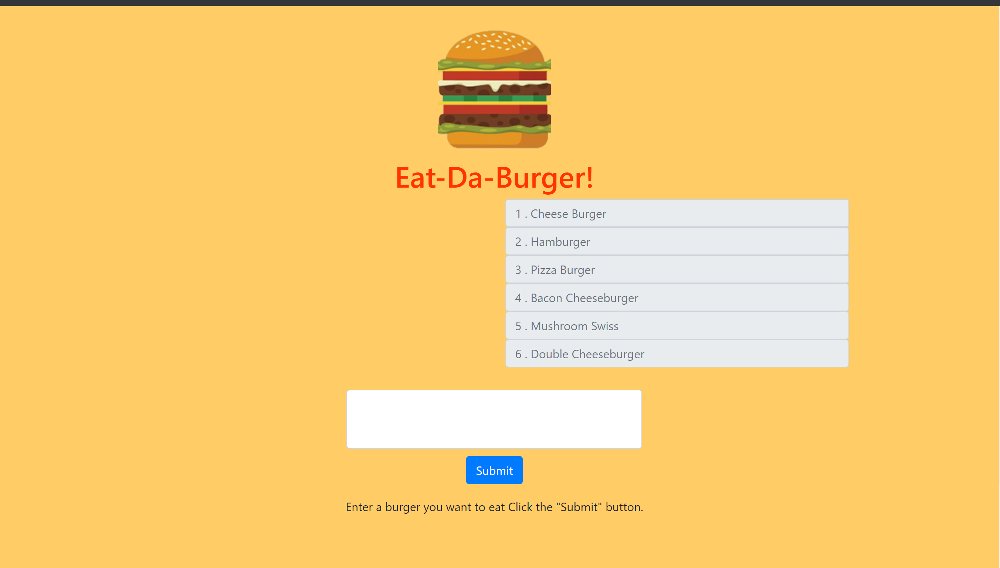

# Burger App

## Description

I was tasked with creating a burger application that allows you to submit a burger you want to eat using node js, handlebars and express. It allows easier application use and using handlebars is perfect for the template



## Table of Contents 

* [Installation](#installation)

* [Usage](#usage)

* [License](#license)

* [Contributing](#contributing)

* [Tests](#tests)

* [Questions](#questions)

## Installation

To install necessary dependencies, run the following command:

```
npm i
```

## Usage

This was for a homework assignment of mine. 

## License

This project is licensed under the APACHE 2.0 license.
    
## Contributing

If you would like to contribute please feel free to.

## Tests

To run tests, run the following command:

```
npm test
```

## Questions

If you have any questions about the repo, open an issue or contact me directly at jdefranco449@gmail.com. You can find more of my work at [jdefranco24](https://github.com/jdefranco24/).

